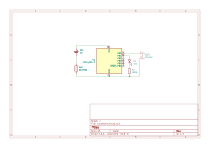

# Lock Alarm
An alarm that starts when you keep the door unlocked longer than 60 seconds (stops after another 60 seconds).

## How to use
1. Attach a neodymium magnet to the thumbturn lock of the door.
1. Attach the reed switch where the magnet comes when the door is open.

## Bill of Materials 

| Ref | Description |
| --- | ---- |
| U1  | ATtiny13A-P |
| SW1 | Reed Switch |
| BT1 | Battery (3V) |
| BZ1 | Buzzer |
| D1 | LED |
| R1 | Register (300Ω) |
| | Neodymium magnet |

